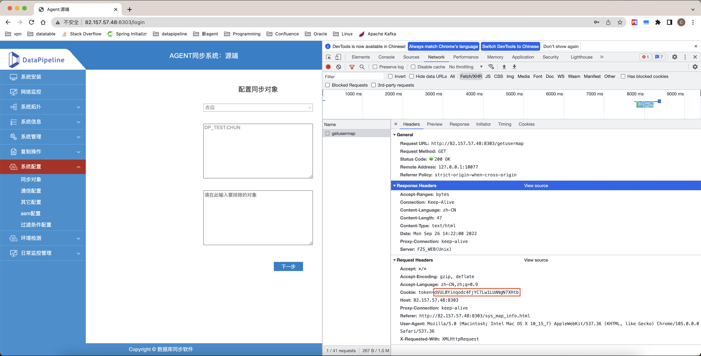
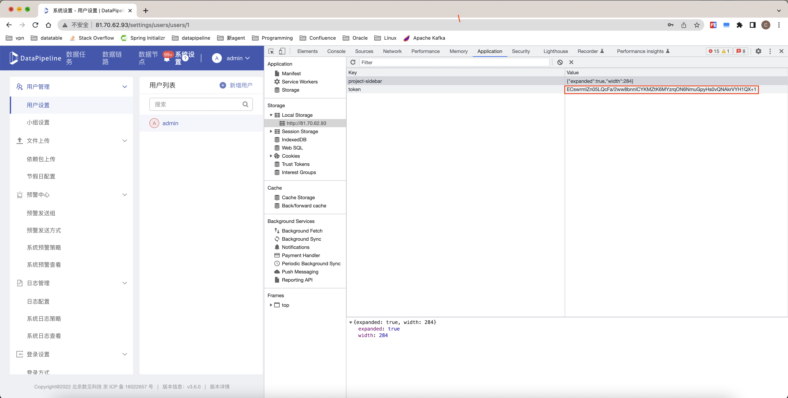

# Agent-Migrate

### 1、使用前确认
在迁移前需确认 新agent 已开启 **web模式**
```shell
# 在新agent 部署机器上执行命令
$ curl localhost:8888/export/health
# 若出现类似这样的结果，则代表 web 已启动
{"status":"UP","checks":[...]}
```

<br>

### 2、需提供的配置信息

在 conf/conf.yml 中添加配置信息

```yaml
# 旧agent的主机ip、web端口、部署根路径、token信息
old:
  host: 82.157.57.48
  web_port: 8303
  path: /home/zc-agent/
  token: dVUL0Yinqodc4FjYC7Lw1LUANgN7XHtb
# 新agent的主机ip、web端口
new:
  host: 82.157.57.48
  web_port: 8888
# DP的主机ip、web端口、token信息
dp:
  host: 81.70.62.93
  web_port: 5000
  token: ECswrmIZn05LQcFa/2ww8bnnICYKMZtK6MYzrqON6NmuGpyHs0vQNAkrVYH1QX+1
```

<br>

#### 查看旧agent 的 Token信息

1、登录旧agent 的源端

2、打开开发者模式

3、点击同步对象

4、点击 Network（网络）中的 getusermap 请求

5、查看 Request Headers（请求标头） 中 Cookie 的 token 值（见附图）



<br>

#### 查看 DP 的 Token信息

1、登录DP

2、打开开发者模式

3、点击 Application（应用） 中的 Local Storage（本地存储空间）

4、查看 DP 所在服务器的 token 值（见附图）

